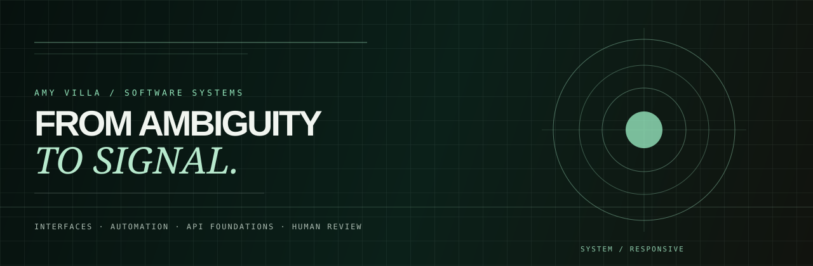

  

<h1 align="center">Amy Villa</h1>

  <strong>AI Automation &amp; Technical Solutions Engineer</strong> 
  Building API-driven automation, implementation systems, and developer-facing product experiences.

  <a href="mailto:amyv.dev@gmail.com">Email</a> ·
  <a href="https://github.com/Amyvdev1/amy-technical-portfolio">Portfolio source</a>

---

## Start here

| Project | What it proves | Review path |
|---|---|---|
| **01 — [MailTrace DX Lab](https://github.com/Amyvdev1/Amyvdev1-mailtrace-dx-lab)** | Developer observability · webhook reliability · API debugging | HMAC signatures, idempotency, retries, event ordering, raw payloads, error contracts, Next.js, strict TypeScript, SQLite, Playwright |
| **02 — [ForgeFlow AI Automation](https://github.com/Amyvdev1/forgeflow-ai-automation)** | AI automation systems · full-stack workflow execution | Structured execution, optional AI provider, deterministic fallback, persistence, workflow state, human review, FastAPI |
| **03 — [Signal Engine](https://github.com/Amyvdev1/amy-technical-portfolio)** | Product engineering narrative · recruiter evidence interface | React/TypeScript, product-state communication, technical review paths, tested interaction behavior |
| **04 — [ClearRoute API](https://github.com/Amyvdev1/clearrout-api)** | API design · explicit workflow state | Typed validation, state transitions, role rules, audit events, predictable API contracts |
| **05 — [AccessPath Console](https://github.com/Amyvdev1/accessible-workflow-console)** | Product engineering · accessibility | Keyboard UX, semantic HTML, error recovery, visible state feedback, axe/Vitest checks |

## Core

**TypeScript · React · Next.js · Python/FastAPI · APIs · Automation · Testing**

I build systems where implementation details are inspectable: state is visible, failure behavior is explicit, automation keeps human review in view, and the code can be verified through tests and CI.

**Native English + Spanish · Remote collaboration**

> The repositories above are independent public engineering samples. They demonstrate documented implementation choices and technical judgment without claiming production scale, customer outcomes, or experience that is not evidenced in the repositories.

**Contact:** [amyv.dev@gmail.com](mailto:amyv.dev@gmail.com)
